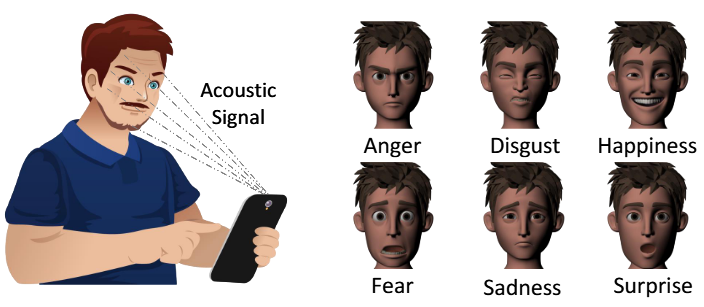
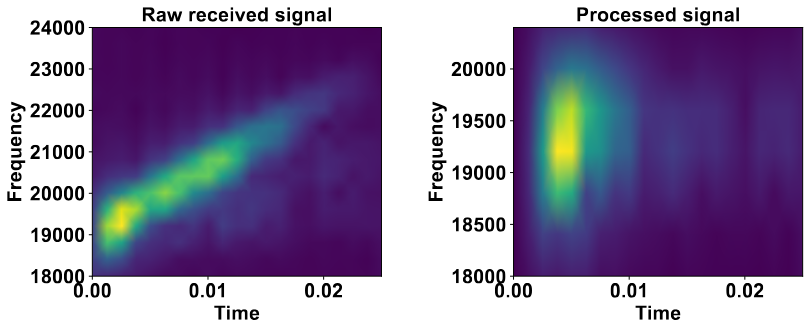
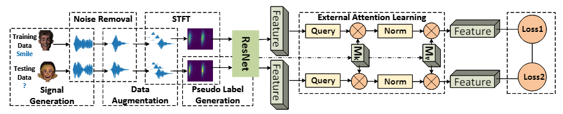

# Decoding Emotions: Unveiling Facial Expressions through Acoustic Sensing with Contrastive Attention

This repo covers a reference implementation for the following papers in PyTorch:

* [FacER: Contrastive Attention based Expression Recognition via Smartphone Earpiece Speaker](https://ieeexplore.ieee.org/abstract/document/10228985)

* [Decoding Emotions: Unveiling Facial Expressions through Acoustic Sensing with Contrastive Attention](https://arxiv.org/pdf/2410.12811)

## Data Collection
We collect acoustic facial expression data from 20 volunteers. At the beginning of the data collection, we show the six standard facial expressions: anger, disgust, fear, happiness, sadness, and surprise. We utilized two Android smartphones: the Samsung Galaxy A21 and OnePlus 8T, for collecting acoustic signals. Due to the IRB requirement, the collected data is not going to be released. Nevertheless, we have released the data collection app source code. The app for acoustic sensing data collection leverages frameworks from LibAS and Chaperone, which are designed for acoustic sensing applications. Please check [App Demo](app_demo/) for details.

<p align="center">
  
</p>

## Data Processing
The end-to-end data processing steps are included in [dataset_construction.py](dataset_construction.py). In addition, we design a series of data augmentation methods including inter and intra-sample augmentation to enlarge the training data size so as to reduce the data collection and labeling costs.

<p align="center">
  
</p>

## Model Design
The ResNet model is adopted as the backbone model. We design an external cross-sample attention-based learning model to capture robust expression features. This approach enables the model to extract the essential representation of expressions while filtering out background noises. Besides, we design a domain adaptation contrastive learning algorithm to align the distributions of the source and target domain datasets.

<p align="center">
  
</p>

## Usage
This repo requires general packages such as ```torch, numpy, argparse, os, random, pandas, pickle, json, itertools, time, math, sklearn``` for computation. In particular, we use ```dtaidistance``` for dynamic time warping distance calculation. Please check running commands in [scripts](./scripts/), and here is an example:
```
python main.py \
    --case 6 \
    --epochs 100 \
    --learning_rate 0.1 \
    --round 150 \
    --train_mode \
    --data_saved # using the existing built data
```

## Reference
```
@inproceedings{wang2023facer,
  title={Facer: Contrastive attention based expression recognition via smartphone earpiece speaker},
  author={Wang, Guangjing and Yan, Qiben and Patrarungrong, Shane and Wang, Juexing and Zeng, Huacheng},
  booktitle={IEEE INFOCOM 2023-IEEE Conference on Computer Communications},
  pages={1--10},
  year={2023},
  organization={IEEE}
}

@article{wang2024decoding,
  title={Decoding Emotions: Unveiling Facial Expressions through Acoustic Sensing with Contrastive Attention},
  author={Wang, Guangjing and Wang, Juexing and Zhou, Ce and Ding, Weikang and Zeng, Huacheng and Li, Tianxing and Yan, Qiben},
  journal={arXiv preprint arXiv:2410.12811},
  year={2024}
}
```